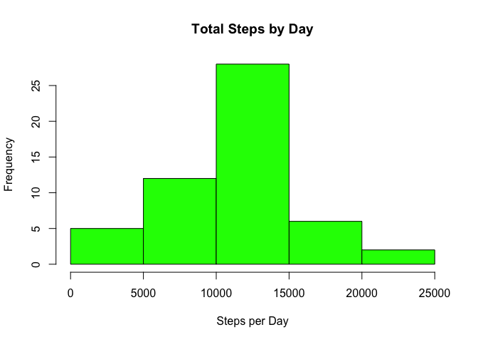
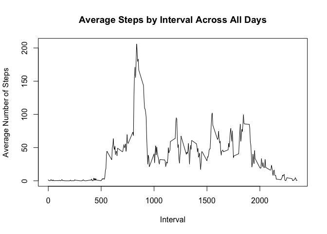
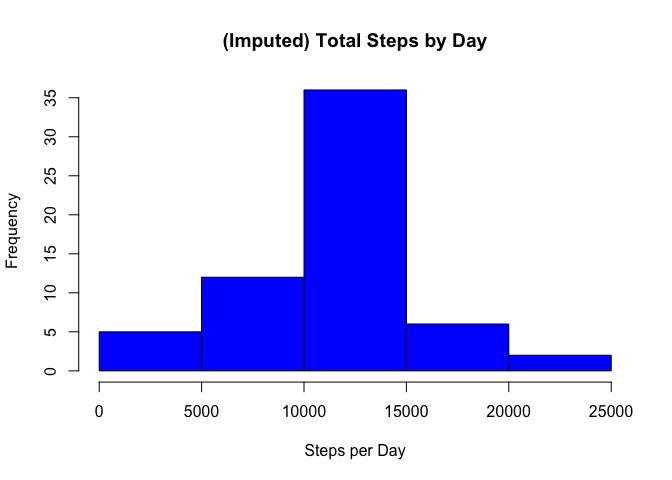
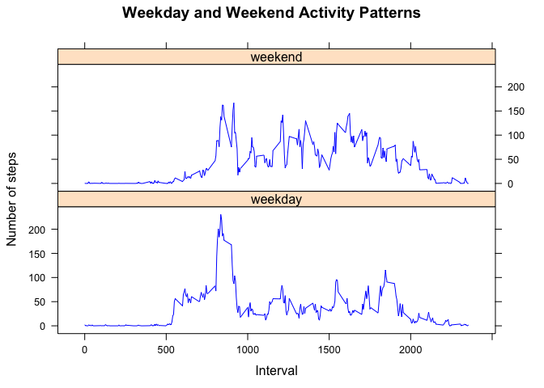

# Reproducible Research: Peer Assessment 1

## Loading and preprocessing the data


```r
## set the working directory
setwd("~/Documents/workspace/datasciencecoursera/ReproducibleResearch/PeerAssessment1/RepData_PeerAssessment1")

## check if the data directory exists and create it if it does not exist
if (!file.exists("data")) {
  dir.create("data")
}

## URL and file to download
fileURL <- "https://d396qusza40orc.cloudfront.net/repdata%2Fdata%2Factivity.zip"  

## download the file
download.file(fileURL, destfile = "./data/activity.zip", method = "curl")         

## unzip the file
unzip("./data/activity.zip", exdir = "./data")                                    

## record the download date and time
fileConn <- file("./data/downloadedOn.txt")
writeLines(c("Latest Download", date()), fileConn)
close(fileConn)

## read the data into a data frame
activityData <- read.csv("./data/activity.csv", header = TRUE, sep = ",") 
```

## What is mean total number of steps taken per day?
1. Calculate the total number of steps taken per day
2. Make a histogram of the total number of steps taken each day
3. Calculate and report the mean and median of the total number of steps taken per day


```r
## remove observations with NA
activityNoNA <- na.omit(activityData)

## use the aggregate function to calculate the total steps taken per day
totalStepsByDay <- aggregate(steps ~ date, activityNoNA, sum)

## create a histogram of the total number of steps taken per day
hist(totalStepsByDay$steps,
     main = "Total Steps by Day",
      xlab = "Steps per Day",
      col = "green")
```

 

```r
## calculate the mean and median of the total number of steps taken per day
activityMean <- mean(totalStepsByDay$steps)                  # calculate the mean
activityMedian <- median(totalStepsByDay$steps)              # calculate the median
cat("Mean (removed missing values):", activityMean)          # concatenate a label with a result for mean
```

```
Mean (removed missing values): 10766.19
```

```r
cat("Median (removed missing values):",  activityMedian)     # concatenate a label with a result for median
```

```
Median (removed missing values): 10765
```


## What is the average daily activity pattern?
1. Make a time series plot of the 5-minute interval (x-axis) and the average number of steps taken, averaged across all days (y-axis)
2. Which 5-minute interval, on average across all the days in the dataset, contains the maximum number of steps?


```r
## use the aggregate function to calculate the average steps taken per interval
averageStepsByInterval <- aggregate(steps ~ interval, activityNoNA, mean)

## create a plot of the average number of steps taken per interval
plot(averageStepsByInterval$interval,
      averageStepsByInterval$steps,
      type = "l",
      main = "Average Steps by Interval Across All Days",
      xlab = "Interval",
      ylab = "Average Number of Steps")
```

 

```r
## identify the 5-minute interval, on average across all days, contains the maximum number of steps
maxAverageStepsInterval <- averageStepsByInterval[which.max(averageStepsByInterval$steps), 1]
cat("5-minute interval with the maximum number of steps on average: ", maxAverageStepsInterval)
```

```
5-minute interval with the maximum number of steps on average:  835
```


## Imputing missing values
Note that there are a number of days/intervals where there are missing values (coded as NA). The presence of missing days may introduce bias into some calculations or summaries of the data.

1. Calculate and report the total number of missing values in the dataset (i.e. the total number of rows with NAs)
2. Devise a strategy for filling in all of the missing values in the dataset. 
3. Create a new dataset that is equal to the original dataset but with the missing data filled in.
4. Make a histogram of the total number of steps taken each day and Calculate and report the mean and median total number of steps taken per day. Do these values differ from the estimates from the first part of the assignment? What is the impact of imputing missing data on the estimates of the total daily number of steps?


```r
# calculate and report the total number of missing values in the data set (the number of rows with NAs)
missingValues <- nrow(activityData) - nrow(activityNoNA)
cat("Missing Values (rows with NAs): ", missingValues)
```

```
Missing Values (rows with NAs):  2304
```

```r
# My strategy to fill in the missing values is to use the interval means. I assumed sleep and wake cycles are relatively consistent over time.
# The code is  based on http://www.mail-archive.com/r-help@r-project.org/msg58289.html
# imputeData satisfies requirement 3 to create a new dataset equal to the original but with the missing data filled in
imputeData <- activityData
library(plyr)
impute.mean <- function(x) replace(x, is.na(x), mean(x, na.rm = TRUE))              # create the function to impute the mean
imputeData <- ddply(imputeData, ~ interval, transform, steps = impute.mean(steps))  # replace the NAs with the imputed mean for that interval across all days
imputeData <- imputeData[order(imputeData$date, imputeData$interval), ] # plyr orders by group so reorder by date and interval

## use the aggregate function to calculate the total steps taken per day
imputedTotalStepsByDay <- aggregate(steps ~ date, imputeData, sum)

## create a histogram of the total number of steps taken per day
hist(imputedTotalStepsByDay$steps,
     main = "(Imputed) Total Steps by Day",
      xlab = "Steps per Day",
      col = "blue")
```

 

```r
## calculate the mean and median of the total number of steps taken per day
imputedActivityMean <- mean(imputedTotalStepsByDay$steps)      # calculate the mean
imputedActivityMedian <- median(imputedTotalStepsByDay$steps)  # calculate the median
cat("Mean (imputed):", imputedActivityMean)                       # concatenate a label with a result for mean
```

```
Mean (imputed): 10766.19
```

```r
cat("Median (imputed):",  imputedActivityMedian)                  # concatenate a label with a result for median
```

```
Median (imputed): 10766.19
```

**Question:** Do these values differ from the estimates from the first part of the assignment?   
**Answer:** The mean for both the calculation with NAs removed and for the calculation with imputed values are the same (10766.19).  This is makes sense as my approach was to use the mean per interval for the imputed value.

**Question:** What is the impact of imputing missing data on the estimates of the total daily number of steps?  
**Answer:** By using the mean per interval as the imputed value, the median changed from 10765 to 10766.19, or .011%.  This is does not have a statistically significant impact on this analysis.

## Are there differences in activity patterns between weekdays and weekends?
1. Create a new factor variable in the dataset with two levels (weekday and weekend).
2. Make a panel plot containing a time series plot of the 5-minute interval (x-axis) and the average number of steps taken, averaged across all weekday days or weekend days (y-axis).


```r
# create factor variable for weekday and weekend
weekdayList <- c("Monday", "Tuesday", "Wednesday", "Thursday", "Friday")

# create a new column for day of week
imputeData$dayofweek = as.factor(ifelse(is.element(weekdays(as.Date(imputeData$date)), weekdayList), "weekday", "weekend"))

# calculate the mean of steps by day of week
totalStepsByDayOfWeek <- aggregate(steps ~ interval * dayofweek, imputeData, mean)

# create the time series plot of the 5-minute intervals averaged across all weekday days and weekend days
library(lattice)

xyplot(steps ~ interval | dayofweek,
       totalStepsByDayOfWeek,
       type = "l",
       layout = c(1,  2),
       xlab = "Interval",
       ylab = "Number of steps",
       main = "Weekday and Weekend Activity Patterns", 
       col = "blue")
```

 
